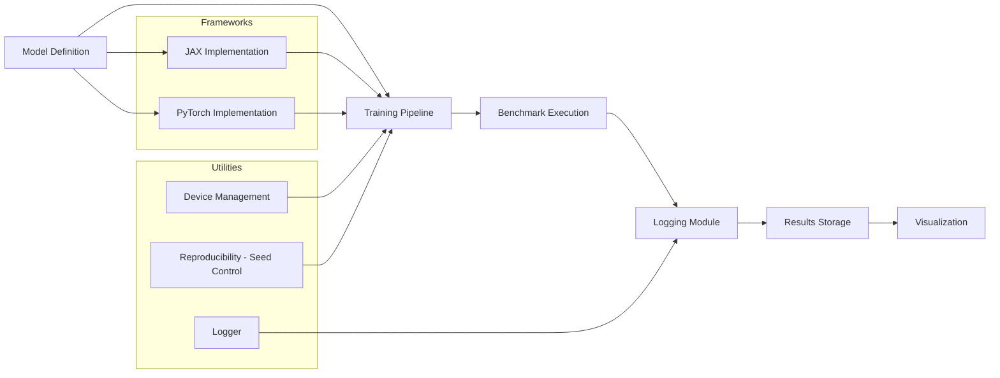

# JAX vs PyTorch Benchmark Analysis  
A Scientific Machine Learning Benchmarking Framework for Deep Learning Systems

---

## Overview

This repository provides a systematic benchmarking framework for comparing two widely used deep learning libraries:

- JAX — designed for high-performance numerical computing with composable transformations  
- PyTorch — known for flexibility, dynamic computation graphs, and strong ecosystem support  

Modern machine learning workflows require:

- computational efficiency  
- scalability across hardware  
- reproducibility  
- consistent evaluation  

This project enables controlled, reproducible comparisons between JAX and PyTorch across identical workloads, focusing on performance, scalability, and training behavior.

---

## Motivation

Deep learning frameworks differ significantly in their underlying design:

- JAX emphasizes functional programming, JIT compilation, and XLA-based optimizations  
- PyTorch emphasizes usability, debugging ease, and production-ready tooling  

Despite widespread usage, there is limited standardized benchmarking under identical experimental conditions.

This repository addresses that gap by providing a unified benchmarking environment for fair and reproducible evaluation.

---

## Core Components

### Model Implementations

The repository includes equivalent architectures across frameworks:

- Convolutional Neural Networks (CNNs)
- Transformer-based models

These implementations ensure fair comparisons under identical configurations.

---

### Benchmarking Engine

The benchmarking module evaluates:

- training time per epoch  
- throughput (samples per second)  
- memory usage  
- convergence characteristics  

Both frameworks are evaluated under consistent hardware and dataset conditions.

---

### Logging and Reproducibility

- structured logging in JSON and CSV formats  
- device-aware execution (CPU and GPU)  
- seed control for reproducibility  

---
## System Architecture


    
### Visualization

The framework generates:

- training loss curves  
- performance comparison plots  
- throughput analysis  
- convergence graphs  

<table>
  <tr>
    <td align="center">
      <br/>
      <b>Effective GPU Throughput vs Batch Size</b><br/>
    </td>
    <td align="center">
      <br/>
      <b>Gradient Computation Time vs Differentiation</b><br/>
    </td>
    <td align="center">
      <br/>
      <b>JIT Compilation Time vs Model</b><br/>
    </td>
  </tr>
  <tr>
    <td align="center">
      <br/>
      <b>Peak Memory Usage vs Model Size</b><br/>
    </td>
    <td align="center">
      <br/>
      <b>Training Step Time vs Model Architecture</b><br/>
    </td>
  </tr>
</table>


Outputs are saved as:

- PNG files for publication  
- CSV and JSON for further analysis  

---

## Benchmark Workflow

A typical experiment consists of:

1. Defining identical model architectures in JAX and PyTorch  
2. Initializing datasets and training configurations  
3. Running benchmark scripts  
4. Logging metrics  
5. Generating comparative visualizations  

---

## Evaluation Metrics

| Metric              | Description                          |
|--------------------|--------------------------------------|
| Training Time      | Time required per epoch              |
| Throughput         | Samples processed per second         |
| Memory Usage       | Hardware memory consumption          |
| Convergence Speed  | Loss reduction over iterations       |

---

## Applications

This framework supports:

- scientific machine learning research  
- deep learning performance analysis  
- framework comparison studies  
- hardware-aware optimization  
- academic benchmarking  

---

## Future Roadmap

- multi-GPU and distributed benchmarking  
- TPU benchmarking support for JAX  
- mixed precision training evaluation  
- integration with reinforcement learning pipelines  
- automated hyperparameter tuning  

---

## Contributing

Contributions are welcome. You can contribute by:

- adding new model architectures  
- improving benchmarking metrics  
- optimizing training pipelines  
- enhancing visualization tools  

Please open an issue or submit a pull request.

---

## Citation

If you use this repository in research, please cite:

```bibtex
@software{jax_vs_pytorch_benchmark,
  title = {JAX vs PyTorch Benchmark Analysis},
  author = {SciML OpenLab},
  year = {2026},
  url = {https://github.com/SciML-OpenLab/JAX-vs-PyTorch-Benchmark-Analysis}
}
