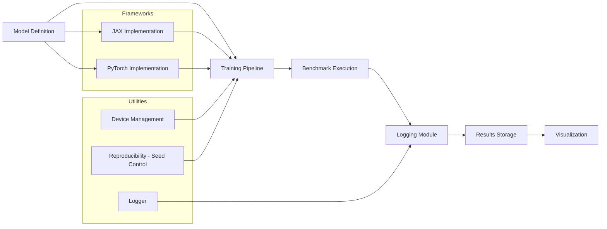

# JAX vs PyTorch Benchmark Analysis  
A Scientific Machine Learning Benchmarking Framework for Deep Learning Systems

---

## Overview

This repository provides a systematic benchmarking framework for comparing two widely used deep learning libraries:

- JAX — designed for high-performance numerical computing with composable transformations  
- PyTorch — known for flexibility, dynamic computation graphs, and strong ecosystem support  

Modern machine learning workflows require:

- computational efficiency  
- scalability across hardware  
- reproducibility  
- consistent evaluation  

This project enables controlled, reproducible comparisons between JAX and PyTorch across identical workloads, focusing on performance, scalability, and training behavior.

---

## Motivation

Deep learning frameworks differ significantly in their underlying design:

- JAX emphasizes functional programming, JIT compilation, and XLA-based optimizations  
- PyTorch emphasizes usability, debugging ease, and production-ready tooling  

Despite widespread usage, there is limited standardized benchmarking under identical experimental conditions.

This repository addresses that gap by providing a unified benchmarking environment for fair and reproducible evaluation.

---

## Core Components

### Model Implementations

The repository includes equivalent architectures across frameworks:

- Convolutional Neural Networks (CNNs)
- Transformer-based models

These implementations ensure fair comparisons under identical configurations.

---

### Benchmarking Engine

The benchmarking module evaluates:

- training time per epoch  
- throughput (samples per second)  
- memory usage  
- convergence characteristics  

Both frameworks are evaluated under consistent hardware and dataset conditions.

---

### Logging and Reproducibility

- structured logging in JSON and CSV formats  
- device-aware execution (CPU and GPU)  
- seed control for reproducibility  

---
## System Architecture


    
### Visualization

The framework generates:

- training loss curves  
- performance comparison plots  
- throughput analysis  
- convergence graphs  

<!DOCTYPE html>
<html lang="en">
<head>
    <meta charset="UTF-8">
    <meta name="viewport" content="width=device-width, initial-scale=1.0">
    <title>Benchmark Dashboard</title>
    <style>
        /* Matches the dark aesthetic from your reference image */
        body {
            background-color: #0b0e14;
            color: #ffffff;
            font-family: 'Segoe UI', Tahoma, Geneva, Verdana, sans-serif;
            margin: 0;
            padding: 40px;
        }
        
        .dashboard-grid {
            display: grid;
            grid-template-columns: repeat(3, 1fr); /* 3 columns */
            gap: 25px; /* Space between the cards */
            max-width: 1400px;
            margin: 0 auto;
        }

        /* Individual Card Style */
        .chart-card {
            background-color: #0b0e14;
            border: 1px solid #333;
            padding: 15px;
            text-align: center;
            display: flex;
            flex-direction: column;
            justify-content: space-between;
        }

        .chart-card img {
            width: 100%;
            height: auto;
            border-bottom: 1px solid #222;
            margin-bottom: 15px;
        }

        /* Caption Styling */
        .chart-title {
            font-size: 1.2rem;
            font-weight: bold;
            margin: 10px 0 5px 0;
        }

        .chart-desc {
            font-size: 0.9rem;
            color: #aaaaaa;
            margin-bottom: 10px;
        }

        /* Responsive: Stack cards on smaller screens */
        @media (max-width: 1000px) {
            .dashboard-grid { grid-template-columns: repeat(2, 1fr); }
        }
        @media (max-width: 600px) {
            .dashboard-grid { grid-template-columns: 1fr; }
        }
    </style>
</head>
<body>

    <div class="dashboard-grid">
        
        <div class="chart-card">
            
            <div class="chart-title">Gradient Computation</div>
            <div class="chart-desc">Comparison of execution time across different differentiation orders.</div>
        </div>

        <div class="chart-card">
            
            <div class="chart-title">Peak Memory Usage</div>
            <div class="chart-desc">MB consumption scaled against total model parameters.</div>
        </div>

        <div class="chart-card">
            
            <div class="chart-title">Effective Throughput</div>
            <div class="chart-desc">TFLOPS performance vs batch size scaling.</div>
        </div>

        <div class="chart-card">
            
            <div class="chart-title">JIT Compilation Time</div>
            <div class="chart-desc">Initial overhead comparison for different architectures.</div>
        </div>

        <div class="chart-card">
            
            <div class="chart-title">Training Step Time</div>
            <div class="chart-desc">Latency per step for standard model architectures.</div>
        </div>

        <div class="chart-card" style="border-style: dashed; opacity: 0.3;">
            <div style="height: 200px; display: flex; align-items: center; justify-content: center;">
                Future Metric
            </div>
            <div class="chart-title">Pending Analysis</div>
            <div class="chart-desc">Additional data point to be added.</div>
        </div>

    </div>

</body>
</html>

Outputs are saved as:

- PNG files for publication  
- CSV and JSON for further analysis  

---

## Benchmark Workflow

A typical experiment consists of:

1. Defining identical model architectures in JAX and PyTorch  
2. Initializing datasets and training configurations  
3. Running benchmark scripts  
4. Logging metrics  
5. Generating comparative visualizations  

---

## Evaluation Metrics

| Metric              | Description                          |
|--------------------|--------------------------------------|
| Training Time      | Time required per epoch              |
| Throughput         | Samples processed per second         |
| Memory Usage       | Hardware memory consumption          |
| Convergence Speed  | Loss reduction over iterations       |

---

## Applications

This framework supports:

- scientific machine learning research  
- deep learning performance analysis  
- framework comparison studies  
- hardware-aware optimization  
- academic benchmarking  

---

## Future Roadmap

- multi-GPU and distributed benchmarking  
- TPU benchmarking support for JAX  
- mixed precision training evaluation  
- integration with reinforcement learning pipelines  
- automated hyperparameter tuning  

---

## Contributing

Contributions are welcome. You can contribute by:

- adding new model architectures  
- improving benchmarking metrics  
- optimizing training pipelines  
- enhancing visualization tools  

Please open an issue or submit a pull request.

---

## Citation

If you use this repository in research, please cite:

```bibtex
@software{jax_vs_pytorch_benchmark,
  title = {JAX vs PyTorch Benchmark Analysis},
  author = {SciML OpenLab},
  year = {2026},
  url = {https://github.com/SciML-OpenLab/JAX-vs-PyTorch-Benchmark-Analysis}
}
